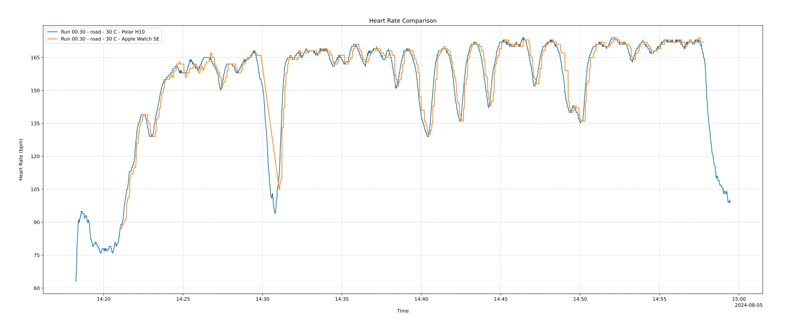
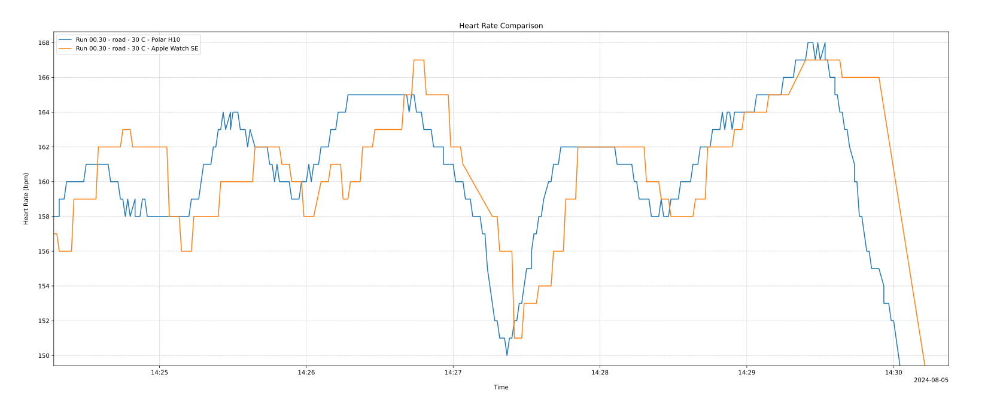
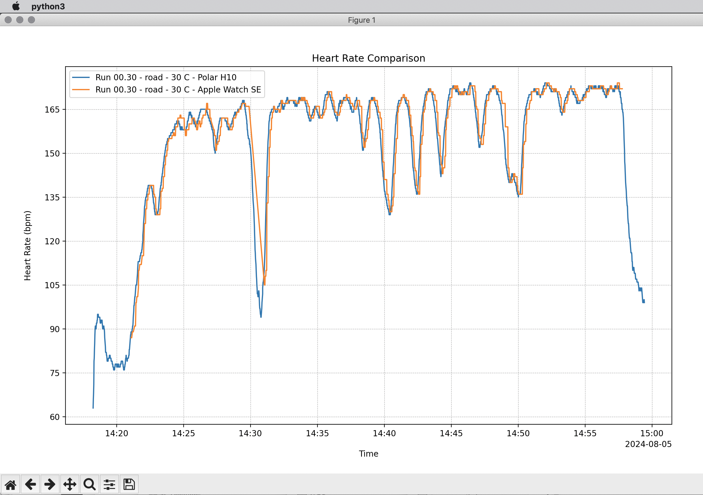

# FitFilesAnalysisDeparalysis

FitFilesAnalysisDeparalysis is a Python toolkit designed to unfreeze your fitness data, helping you analyze and compare metrics like heart rate, speed, and cadence from FIT files. Whether you’re trying to figure out which heart rate monitor is more precise (hint: the Polar H10) or lying (hint: the Apple Watch, but just a little)… Or want to compare how 2-5 runners’ hearts respond to your run together.

I couldn’t trust Strava.app or WorkOutdoors.app (even though it’s awesome). I wanted the beat-by-beat plotting, zooming in, overlays… Accuracy? Latency? Sampling rate? Sudden HR changes? Yes.



## Features

- **Multi-Metric Analysis**: Compare heart rate, and, _in the near future_, speed, cadence, and other metrics across multiple FIT files.
- **Visual Comparison**: Generate plots for up to 5 simultaneous activities—no more guessing which device is the most accurate!
- **Dynamic Plotting**: Zoom in, pan around, and get up close with your data — the axes’ ticks will adjust automatically for increasing precision
- **Save Your Insights**: Export plots as vector graphics — PDF or SVG — perfect to show those doubting the accuracy of this or that, or just to brag a little.



## Requirements

- Python 3.x → installed by your favorite method (Homebrew, anaconda… I prefer compiling from source to my `/usr/local/` 🤪
- `matplotlib` package → I use pip
- `fitparse` package

## Installation

1) Install the packages
```bash
pip install matplotlib fitparse
```
2) Place the [fit_files_compare_HR.py](fit_files_compare_HR.py) in a folder of your choosing
3) create a `fit_files_compare` folder next to it (to drop the FIT files into)

## Usage

1. Export your fitness data from any tracking app like Strava, WorkOutdoors, etc., as FIT files.
2. Drop up to 5 FIT files into the `fit_files_compare` directory. Or plot just 1.
3. Run the script from the command line:

```bash
cd /path/to/where_you_placed_the_python_file_directory
python fit_files_compare_HR.py
```
Of course, you can simply type `python` in a terminal and drag and drop the [fit_files_compare_HR.py](fit_files_compare_HR.py) from your files’ manager (such the MacOS Finder.app or Windows Explorer).

4. The script will open your files in a GUI window, with a plot per file. Zoom in, pan around, and if you’re feeling generous, save the plot as a PDF or SVG.



## Customization

Open the [fit_files_compare_HR.py](fit_files_compare_HR.py) in your favorite plain text editor and change:

- the `save` button format to 'pdf' or 'svg
- whether you’d like to automatically save a PDF and/or an SVG of the plot
- the name and location of the “drop-in FIT files” folder
- the max number of FIT files to compare

## Future Development

- **More Metrics, More Fun**: Coming soon—compare speed, cadence, and other metrics. Let’s dig deeper into that data!
- **Enhanced Visuals**: Think your data looks great now? Just wait until I add zone support and segmenting! After all, I’m a designer.
- **More Plot Customizations**: Because who doesn’t love making their data look as cool as it is informative?

## Project Structure

```plaintext
FitFilesAnalysisDeparalysis/
│
├── /_docs/images/                 # Some example outputs  
├── /fit_files_compare/            # Directory to store your FIT files
├── example_output.pdf             # Example output (generated after running the script)
├── fit_files_compare_HR.py        # Main script file
└── README.md                      # Project documentation
```

## Contributing

If you’ve got ideas to unfreeze even more insights from FIT files, fork away! I welcome pull requests, feature suggestions, or the odd bug report.

## License

This project is licensed under the GPL License - see the [LICENSE](LICENSE) file for details.

## Contact

Created by [Anatoly Ivanov](https://anatolyivanov.com) - if you’ve got questions, feedback, or happen to run / ride in the same area of Paris, LA, the Swiss Alps…
